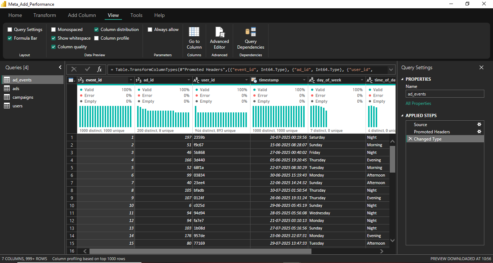

# 📊 Meta Ads Performance Analysis – Power BI Dashboard

 
 

 ### Dashboard File
You can find the file for the dashboard here: [`Meta_Ad_Performance`](Meta_ad_performance.pbix). 

> <a href="https://app.powerbi.com/groups/me/reports/71766dba-b0c3-4caa-b28a-620e14eaf4ba/1f2cb7516c0ce86158ac?experience=power-bi" target="_blank">📊 View interactive dashboard here on the Power BI Service</a>

## 📌 Project Overview
This project analyzes the performance of paid advertising campaigns run on **Meta platforms (Facebook & Instagram)**.  
The goal is to provide the marketing team with a data-driven view of:

- Campaign reach
- Engagement and user behavior
- Ad performance across demographics, geography & time
- Conversion and budget efficiency

The dashboard transforms raw event data into **actionable insights**, helping improve overall ROI and campaign decision-making.

---

## 🧠 Business Problem
Digital ads cost money, and companies need to know:

- Which campaigns are performing well?
- Why are users clicking but not purchasing?
- Which audiences convert better?
- Where should budget be optimized?

This dashboard answers these questions using KPI-focused visual storytelling.

---

## 📂 Dataset Description

The dataset is modeled close to real Meta ad data and follows a **Star Schema** design.

### 📌 Fact Table
#### `ad_events`
Contains every user interaction:

- Impression  
- Click  
- Share  
- Comment  
- Purchase  
- Timestamp  
- User ID  
- Ad ID

All KPIs are calculated from this table.

### 📌 Dimension Tables

#### `ads`
- Platform (Facebook / Instagram)
- Ad type (Video, Image, Carousel, Story)
- Target gender
- Target age group
- Campaign ID

#### `campaigns`
- Campaign name
- Start / End dates
- Total budget

#### `users`
- Gender  
- Age  
- Country  
- Interests

---

## ⭐ KPIs & Formulas

| KPI | Formula | Purpose |
|---|---|---|
| Impressions | Count(Impression) | Reach |
| Clicks | Count(Click) | User interest |
| Engagements | Click + Share + Comment | Total interactions |
| CTR | (Clicks ÷ Impressions) × 100 | Ad effectiveness |
| Engagement Rate | (Engagements ÷ Impressions) × 100 | Content appeal |
| Conversion Rate | (Purchases ÷ Clicks) × 100 | Funnel efficiency |
| Purchase Rate | (Purchases ÷ Impressions) × 100 | ROI strength |
| Total Budget | SUM(campaigns.budget) | Spend measurement |
| Avg Budget / Campaign | Total Budget ÷ No. of Campaigns | Distribution |

---

## 🔽 Funnel Analysis (Major Insight)
- **Top of the funnel is very strong**  
  High CTR and engagement prove ads are attractive.

- **Bottom of the funnel is weak**  
  Low purchase conversion indicates leakage at:

  - Landing page
  - Offer strategy
  - Target alignment

---

## 📈 Dashboard Visuals

### 1️⃣ Donut Chart – Gender Performance
- Shows which gender interacts more.
- Females deliver the highest engagement.

### 2️⃣ Bar Chart – Age Group Engagement
- 18–30 age bracket performs best.
- Performance drops post 35+.

### 3️⃣ Map Visualization – Geographic Insight
- India & Brazil have maximum participation.
- Germany & UK represent potential high-value users.

### 4️⃣ Calendar Heatmap – Daily Engagement
- Identifies peak dates & promotion periods.

### 5️⃣ Weekly Trend – Stacked Column
Compares weekly performance by ad type.

### 6️⃣ Hourly Area Chart – User Active Time
Users most active in:

- Afternoon
- Evening

### 7️⃣ Matrix Table – Ad Format Comparison
**Best format:** Video  
**Second best:** Stories  
Image & Carousel slightly less effective.

---

## 🚀 Tools & Technologies Used

- **Power BI**
- Power Query
- DAX Measures
- Star Schema Modeling
- Domain understanding of Marketing Analytics

---

 
 
 

## 📌 Files Included

- Business Requirement Document  
- Domain Knowledge Document  
- Dashboard Insights  
- Interview Explanation Script  

---

## 🧠 Key Outcomes

This project strengthened:

- Analytical thinking  
- KPI-driven data storytelling  
- Dashboard UI/UX development  
- Digital marketing performance understanding  
- Data transformation & modeling skills

---

## 🙋‍♂️ About Me

I’m a Data Analytics & Power BI learner focusing on real-world, business-oriented dashboards.  
Open to feedback and suggestions to improve further!

---

## ⭐ Feedback

Feel free to raise an issue or share suggestions.  
Thank you for visiting this project! 😊
